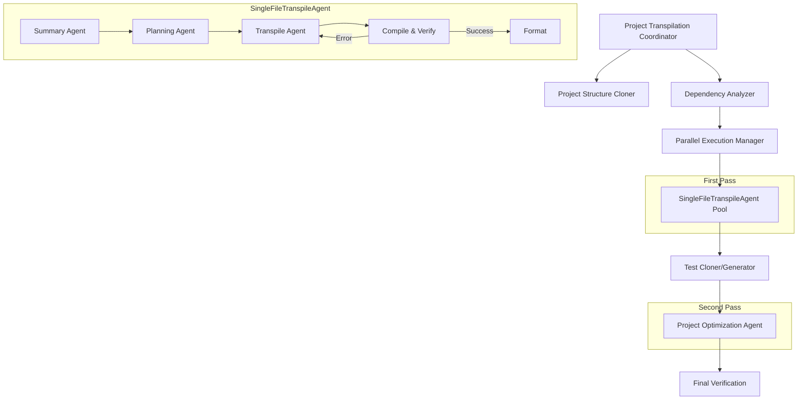

# LLM Transpiler
An attempt at building an LLM powered code-transpiler that follows a flow similar to [AlphaCodium](https://www.codium.ai/products/alpha-codium/) but using [Langgraph](https://langchain-ai.github.io/langgraph/) and commercial LLMs.

## Table of Contents
1. [Simple Transpile](#simple-transpile) - A minimal working version of transpiler that does transpiles the original code, tries compiling it and runs back-and-forth between the transpiler and compiler nodes until the code is error free.
2. [Complex Transpile](#complex-transpile) - A more advanced version that adds more nodes and more sophisticated logic to transpile code with higher precision.
3. [Project-Level Transpile](#project-level-transpile) - A comprehensive solution for transpiling entire projects with multiple files, including dependency analysis, parallel processing, and optimization.

## Simple Transpile


A basic version of transpiler can be found at [`src/simple_transpile.py`](https://github.com/tanaymeh/llm-code-transpiler/blob/main/src/simple_transpile.py). This version transpiles the code from Java to Python and then tries to parse the Python code using the AST module. If the code throws any compile-time errors, it captures the stack trace and sends it back to the "transpile" node along with the original code and a different prompt on how to deal with it.
init_model

## Complex Transpile


A more complex version of transpiler can be found at [`src/complex_transpile.py`](https://github.com/tanaymeh/llm-code-transpiler/blob/main/src/complex_transpile.py). This version, builts on top of small transpiler by adding a summary node as the entry point of the graph and a formatter at the end of the graph.

The original code first flows into the summary node which uses an LLM to generate a concise, technical summary of the original code file including details about what each class and function does. This summary then, along with the original code is passed to the plan generation node which generates a step by step plan on how to transpile the code (in an attempt to make the transpilation as accurate as possible), this plan along with the original code is sent to the search node which first generates 10 questions from the original code that the LLM deems "complex" and then searches the answers for those questions using [GoogleSerper](https://python.langchain.com/v0.2/docs/integrations/tools/google_serper/) (you need a Serper.dev API to run this). These Question-Answer pairs are appended to the end of the plan.

This plan then, along with the original code is sent to the transpile node which generates the transpiled code. The transpiled code is sent to the compilation node which tries compiling the code. If it fails, the error message along with the original code is sent back to the transpile node and this process continues until either the code compiles error-free or if we hit a set maximum number of iterations (to stop getting into an infinite loop).

The final node is a format node which uses Black formatter in Python to format the code at the end of successful compilation to meet the PEP8 standards.

## Project-Level Transpile



The project-level transpilation extends the complex transpile workflow to handle entire projects with multiple files. This approach enables transpiling large Java projects to Python while maintaining the project structure and ensuring compatibility between files.

### Features

- **Project Structure Cloning**: Automatically mirrors the source project structure in the target directory.
- **Dependency Analysis**: Analyzes dependencies between files to determine the optimal transpilation order.
- **Parallel Processing**: Transpiles multiple files concurrently for faster processing.
- **Test Handling**: Clones and adapts test files or generates new tests for the transpiled code.
- **Two-Pass Optimization**: 
  1. First pass: Transpiles individual files while maintaining compatibility
  2. Second pass: Optimizes the entire project for more idiomatic Python code

### Usage

```bash
./run_project_transpile.py --model-name gpt-4-turbo --source-dir /path/to/java/project --target-dir /path/to/output/python/project
```

#### Command-line Arguments

- `--model-name`: LLM model name (required)
- `--source-dir`: Path to source Java project directory (required)
- `--target-dir`: Path to target Python project directory (required)
- `--concurrency`: Number of parallel transpilation agents (default: 3)
- `--max-retries`: Maximum transpilation retries on error (default: 2)
- `--skip-optimization`: Skip the optimization phase (optional)
- `--skip-tests`: Skip test cloning/generation (optional)
- `--report-file`: Path to save the transpilation report (default: transpilation_report.json)

### Workflow

1. **Project Structure Cloning**: The source project structure is cloned to the target directory, creating empty Python files.
2. **Dependency Analysis**: Dependencies between Java files are analyzed to determine the optimal transpilation order.
3. **Parallel Transpilation**: Files are transpiled in parallel, respecting dependencies.
4. **Test Handling**: Test files are either cloned from the source project or generated for the transpiled code.
5. **Project Optimization**: The transpiled project is optimized for more idiomatic Python code.

### Output

- Transpiled Python files in the target directory
- Transpilation report with statistics and status of each file
- Manual review report for files that failed transpilation
- Optimization report with details of the optimizations applied
