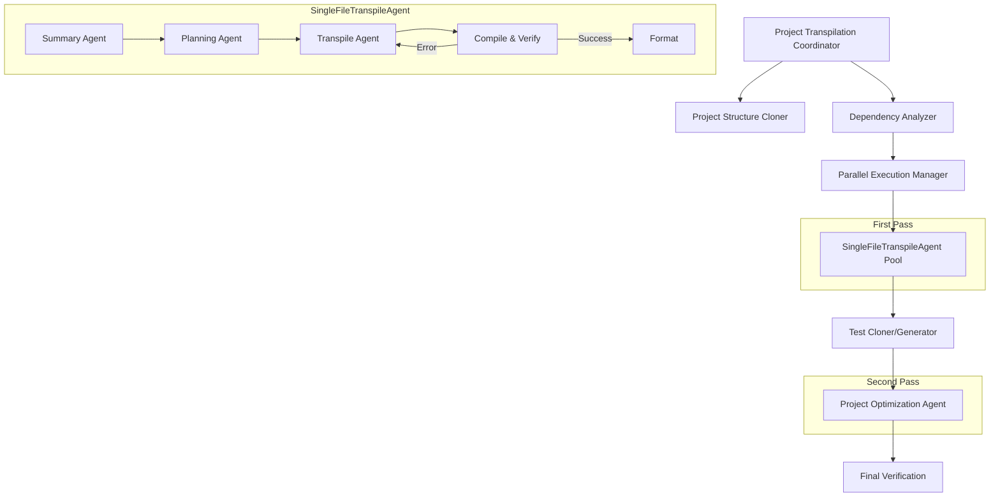

```mermaid
graph TD
    A[Project Transpilation Coordinator] --> B[Project Structure Cloner]
    A --> C[Dependency Analyzer]
    C --> D[Parallel Execution Manager]
    D --> E[SingleFileTranspileAgent Pool]
    E --> F[Test Cloner/Generator]
    F --> G[Project Optimization Agent]
    G --> H[Final Verification]
    
    subgraph "First Pass"
    E
    end
    
    subgraph "Second Pass"
    G
    end
    
    subgraph "SingleFileTranspileAgent"
    I[Summary Agent] --> J[Planning Agent]
    J --> K[Transpile Agent]
    K --> L[Compile & Verify]
    L -->|Error| K
    L -->|Success| M[Format]
    end
```
